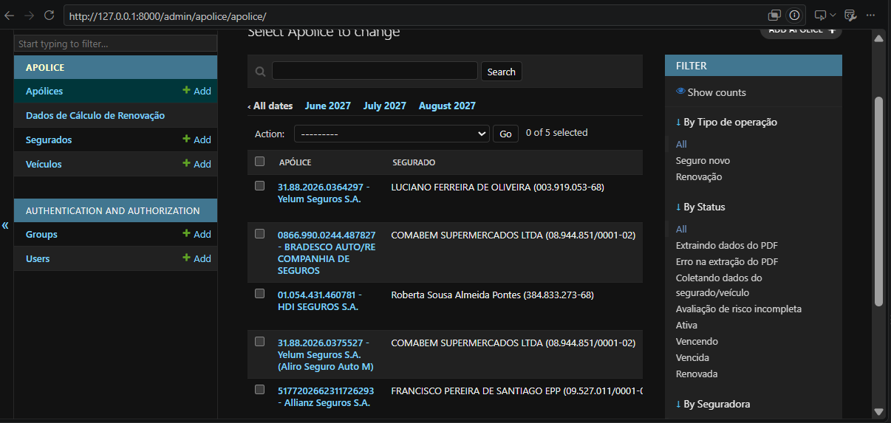
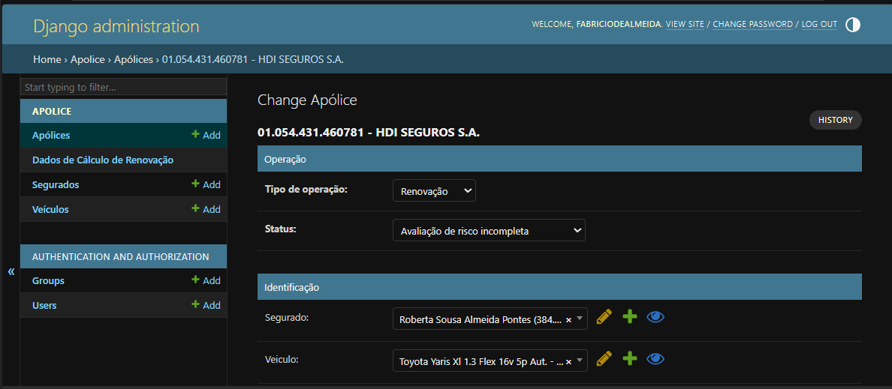

# 📋 Insurance Policy Management System

Django application for auto insurance brokers: centralizes policies,
flags which ones are approaching renewal, and uses the **Anthropic API
(Claude)** to read policy PDFs and automatically extract policyholder,
vehicle, and coverage data — no manual data entry required.

> Built for internal use at a Brazilian insurance brokerage, managing the
> auto insurance policy renewal cycle.

---

## ✨ Features

- **Two intake paths, one system**
  - **Renewal**: attach the current policy's PDF directly in Django Admin.
    Claude-powered extraction runs automatically on save, filling in
    policyholder, vehicle, coverages, and deductibles — no manual typing.
  - **New policy**: when there's no prior policy, a dedicated form
    collects everything from scratch (policyholder, main driver when
    applicable, vehicle, full address).
- **Extraction built for resilience**: automatic retry when the model
  returns an incomplete response, strict schema validation (enums for
  state codes, gender, vehicle type, etc.), and graceful per-field failure
  instead of total failure when a piece of data comes back malformed.
- **Django Admin as the complete UI**: policy listing with a
  days-until-expiration indicator, date drill-down navigation, filters by
  status/insurer, search by policyholder/plate/driver, and a bulk action
  to flag policies as "Expiring soon."
- **Data model faithful to the real domain**: structured addresses (both
  the policyholder's and the vehicle's overnight-parking location, which
  can differ), main driver scoped per policy rather than per policyholder
  (important for fleet clients, where each vehicle can have a different
  driver), a risk-assessment record with a completeness rule, and a
  fallback table for coverage line items that don't fit the fixed schema
  (every insurer describes these a little differently).

## 🏗️ Stack

| Layer | Technology | Why |
|---|---|---|
| Backend | Django 5.2 (LTS) | Free admin interface, mature ORM, long-term stability |
| Database | PostgreSQL | First-class native Django support, no extra drivers/shims |
| PDF extraction | Anthropic API (Claude), forced tool use | Structured schema output, no free-text parsing |
| DB driver | psycopg2-binary | Pre-built wheels, no build headaches on Windows |

### Why not X?

- **DuckDB** was considered (it's a great embedded database), but there is
  no Django backend for it with write support — the only one that exists
  (`django-duckdb-readonly`) deliberately blocks `INSERT`/`UPDATE`/`DELETE`.
  Since Django Admin is fundamentally a write interface built on the ORM,
  PostgreSQL was the correct choice here.

## 📸 Screenshots

> _Add 2-3 screenshots here: the policy list with the days-to-expiration

> indicator, a policy detail page with the coverage/driver inlines


## 🚀 Getting started

### Prerequisites
- Python 3.10+
- A running PostgreSQL instance (local or reachable over the network)
- An Anthropic API key ([console.anthropic.com](https://console.anthropic.com))

### Setup

```bash
git clone <your-repository-url>
cd apolices-django-app

python -m venv venv
venv\Scripts\activate          # Windows
# source venv/bin/activate     # Linux/Mac

pip install -r requirements.txt
```

Create the database and user in PostgreSQL:

```sql
CREATE DATABASE apolices;
CREATE USER apolices_user WITH PASSWORD 'your-password-here';
GRANT ALL PRIVILEGES ON DATABASE apolices TO apolices_user;
ALTER DATABASE apolices OWNER TO apolices_user;
```

Configure your `.env` (copy from `.env.example`):

```bash
cp .env.example .env
```

```
DJANGO_SECRET_KEY=replace-with-a-random-key
DJANGO_DEBUG=True

DB_NAME=apolices
DB_USER=apolices_user
DB_PASSWORD=your-password-here
DB_HOST=localhost
DB_PORT=5432

ANTHROPIC_API_KEY=sk-ant-...
ANTHROPIC_MODEL=claude-sonnet-5
```

Run migrations and create an admin user:

```bash
python manage.py migrate
python manage.py createsuperuser
python manage.py runserver
```

Visit **http://localhost:8000/admin/**.

## 🗂️ Project structure

```
config/                  # Django project configuration
  settings.py             # Database, installed apps, logging, i18n (pt-br)
  urls.py                  # Includes the `apolice` app's routes
apolice/
  models.py                 # Segurado, Veiculo, Apolice, Cobertura, AvaliacaoRisco...
  admin.py                   # Django Admin: list_display, inlines, actions, extraction hook in save_model
  forms.py                    # Forms for the "new policy" intake flow
  views.py                     # New-vs-renewal landing page + new-policy intake
  claude_client.py              # Anthropic API call (forced tool use + retry logic)
  claude_tool_schema.py          # JSON schema that structures the extraction
  claude_extraction.py            # Applies the extracted result to the models
  migrations/
```

Model and field names are kept in Portuguese throughout the codebase,
matching the insurance domain vocabulary used by the brokerage's staff
(who work with the Admin UI directly). Code comments and docstrings are
in English.

## 🧠 Notable design decisions

- **Extraction runs synchronously**, right inside the Admin's
  `save_model` — no task queue, no Celery. Simple enough for a
  brokerage's usage volume, and avoids the operational overhead of a
  queue for a single background step.
- **Automatic retry (up to 3 attempts)** on extraction: even with forced
  tool use, the model occasionally returns a partial response on denser
  documents — the right fix is retrying, not chasing insurer-specific
  edge cases. Validated successfully across PDFs from Yelum/Aliro, HDI,
  Bradesco, Allianz, Porto Seguro, Itaú, and Mitsui Sumitomo with zero
  insurer-specific handling.
- **`CondutorPrincipal` (main driver) belongs to `Apolice`, not
  `Segurado`** — a policyholder (especially a company with a fleet) can
  have multiple policies, each with a different actual driver.
- **Defensive persistence**: even with the tool schema validating types
  and allowed values, the write layer never trusts the response blindly —
  fields that come back oversized or incomplete are dropped individually
  rather than failing the whole extraction.

## 🛣️ Roadmap

- [ ] Dedicated form to complete the Risk Assessment (currently only
      editable via an Admin inline, one policy at a time)
- [ ] Actually generating the renewal-calculation payload
      (`DadosCalculoRenovacao`) and integrating with the Segfy API
- [ ] Richer UI handling for policies with `status = erro_extracao`
      (currently shows the error message but offers no assisted retry)
- [ ] Automated tests (pytest) using the real PDFs already validated
      during development as regression fixtures

## 📄 License

Internal-use project — adjust this section to match your brokerage's
policy (private, proprietary license, or MIT if open-sourcing it).
