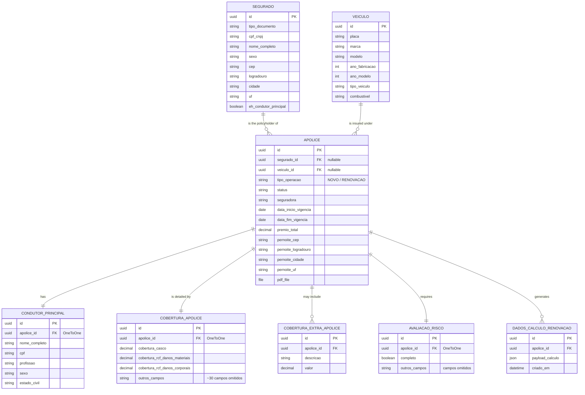

# 📋 Policy Renewal Management System

A Django-based system for a Brazilian auto insurance brokerage to manage policy renewals: upload policy PDFs, automatically extract structured data from them with Claude, track upcoming expirations, and (soon) prepare renewal quote calculations.


---

## What it does

Insurance brokers juggle policy renewals across multiple insurers, each with its own PDF layout. This system gives them a single place to:

1. **Register a policy** through one of two intake paths:
   - **Renewal** — upload the existing policy's PDF; Claude reads it and extracts the policyholder, vehicle, coverage and premium data automatically.
   - **New policy** — no prior PDF exists, so the data is entered manually through a guided form.
2. **Track expirations** — every policy carries a status (`Active`, `Expiring soon`, `Expired`, `Renewed`, …) and its coverage end date, so brokers can see at a glance what needs attention.
3. **Manage the full policy record** — policyholder, vehicle, overnight-parking address, main driver, detailed coverage breakdown, and risk-assessment data, all editable from a single screen.
4. *(Planned)* **Calculate renewals** — prepare and send the structured payload needed to quote a renewal through the Segfy vehicle-quoting API.

## Two front doors, one source of truth

The system ships with **two interfaces on top of the same Django models and business logic** — nothing is duplicated, they just serve different needs:

| | Django Admin | Streamlit |
|---|---|---|
| **Audience** | Power users, full data management | Day-to-day brokers, fast common tasks |
| **Strengths** | Every field editable, inlines for related records, bulk actions, full history | Polished, focused screens; dashboard metrics; no clutter |
| **Covers** | 100% of the data model | Renewal upload + extraction, policy dashboard (more screens planned) |

Both talk to the same PostgreSQL database through the same Django ORM, so a policy created in one shows up instantly in the other.

## Features

- **Two structured intake flows** (`new policy` vs. `renewal`), each collecting exactly what's needed and nothing more.
- **AI-powered PDF extraction** using Claude with forced tool use — a single JSON-schema "tool" that generalizes across insurers (validated across Yelum/Aliro, HDI, Bradesco, Allianz, Porto Seguro, Itaú and Mitsui Sumitomo) rather than being patched per-vendor.
- **Resilient extraction pipeline** — automatic retry on incomplete responses, `max_tokens` cutoff detection, and defensive persistence (field-length truncation, incomplete sub-object skipping) so a single malformed AI response never corrupts the database.
- **Faithful data model** — separate structured addresses for the policyholder and for the vehicle's overnight-parking location; main driver scoped per policy (not per policyholder), correctly supporting fleet policyholders with a different driver per vehicle.
- **Streamlit dashboard**: total policy count, a live count of policies **expiring in the next 30 days**, a paginated (10/page) policy list sorted by expiration date, and a date-range filter to search by expiration window.
- **Django Admin as the system of record**: every model, including coverage line items and risk-assessment fields, is fully manageable with inlines, search, filters and bulk actions.


## Tech stack

| Layer | Technology |
|---|---|
| Backend / ORM | Django 5.2 |
| Database | PostgreSQL (`psycopg2-binary`) |
| Primary UI | Django Admin |
| Secondary UI | Streamlit |
| AI extraction | Anthropic Claude (forced tool use, JSON Schema) |
| PDF storage | Django `FileField` (local media storage) |

## Screenshots


## Getting started

### 1. Clone and set up a virtual environment

```bash
git clone <your-repo-url>
cd apolices-django-app
python -m venv venv
venv\Scripts\activate        # Windows
# source venv/bin/activate   # macOS/Linux
pip install -r requirements.txt
```

### 2. Set up PostgreSQL

```sql
CREATE DATABASE apolices;
CREATE USER apolices_user WITH PASSWORD 'your-password';
GRANT ALL PRIVILEGES ON DATABASE apolices TO apolices_user;
```

### 3. Configure environment variables

Create a `.env` file in the project root:

```env
DJANGO_SECRET_KEY=your-secret-key
DJANGO_DEBUG=True
DB_NAME=apolices
DB_USER=apolices_user
DB_PASSWORD=your-password
DB_HOST=localhost
DB_PORT=5432
ANTHROPIC_API_KEY=your-anthropic-api-key
ANTHROPIC_MODEL=claude-sonnet-5
```

> ⚠️ **Never commit `.env`.** Before your first commit, run `git status` to confirm it isn't tracked — if it already is, remove it with `git rm --cached .env`. Leaking `ANTHROPIC_API_KEY` or the database password is the #1 risk of skipping this step.

### 4. Run migrations and create an admin user

```bash
python manage.py migrate
python manage.py createsuperuser
```

### 5. Run the Django Admin

```bash
python manage.py runserver
```

Visit `http://localhost:8000/admin/`.

### 6. Run the Streamlit front-end

```bash
cd streamlit_app
streamlit run home.py
```

Visit `http://localhost:8501/`.

## Project structure

```
apolices-django-app/
├── config/                    # Django project settings, root URLs
├── apolice/                   # Main Django app
│   ├── models.py              # Segurado, Veiculo, Apolice, CondutorPrincipal,
│   │                           CoberturaApolice, AvaliacaoRisco, ...
│   ├── admin.py                # Django Admin configuration (primary UI)
│   ├── views.py / forms.py     # "New policy" manual intake flow
│   ├── claude_client.py        # Anthropic API wrapper, retry logic
│   ├── claude_tool_schema.py   # JSON Schema for structured extraction
│   ├── claude_extraction.py    # Maps extracted data onto Django models
│   └── migrations/
├── streamlit_app/              # Secondary UI
│   ├── django_setup.py         # Bootstraps Django so Streamlit can use the ORM
│   └── home.py                 # Landing dashboard + renewal upload/processing
├── manage.py
├── requirements.txt
└── .env                        # Local secrets (never committed)
```

## Database schema

The schema is built around `Apolice` (policy) as the central hub. `Segurado` (policyholder) and `Veiculo` (vehicle) are reusable master data — matched by CPF/CNPJ or plate via `get_or_create`, so the same policyholder or vehicle can appear on multiple policies over time. Everything specific to *one* policy (its main driver, its detailed coverage, its risk assessment, its renewal-calculation payloads) hangs directly off `Apolice`, not off the policyholder — this is what correctly supports a company with a vehicle fleet, where each vehicle/policy can have a different driver.



> `COBERTURA_APOLICE` and `AVALIACAO_RISCO` fields are abbreviated above for readability — each has ~20-35 typed fields in the real model.

**Relationship notes:**

- **`Segurado` → `Apolice`** (one-to-many, nullable FK): a policyholder can have several policies over time (renewals, multiple vehicles). The FK is nullable because a policy starts as `EXTRAINDO` before extraction links it to a (possibly newly created) `Segurado`.
- **`Veiculo` → `Apolice`** (one-to-many, nullable FK): same reasoning — a vehicle can appear on several policies across renewal cycles.
- **`Apolice` → `CondutorPrincipal`** (one-to-one): scoped to the *policy*, not the policyholder. This is the key modeling decision in the project — a CNPJ policyholder with a fleet can have a different main driver per vehicle/policy, which a policyholder-scoped relationship couldn't represent.
- **`Apolice` → `CoberturaApolice`** (one-to-one): the structured, typed breakdown of what the policy covers (casco, RCF, glass, towing, etc.).
- **`Apolice` → `CoberturaExtraApolice`** (one-to-many): a fallback for coverage line items that don't map to any of the typed fields above — keeps extraction lossless even for unusual policy clauses.
- **`Apolice` → `AvaliacaoRisco`** (one-to-one, required): risk-assessment data the PDF never contains (garage type, alarm, claims history, etc.) — always created alongside the policy and filled in separately, manually.
- **`Apolice` → `DadosCalculoRenovacao`** (one-to-many): stores the JSON payload(s) prepared for the (planned) Segfy renewal-calculation integration — one-to-many so a policy can be recalculated more than once.
- **`EnderecoMixin`** (not shown as its own table): an abstract base class with the address fields (`cep`, `logradouro`, `numero`, `bairro`, `cidade`, `uf`, …), reused by `Segurado` for the policyholder's address and re-declared with a `pernoite_` prefix directly on `Apolice` for the vehicle's overnight-parking address — the two addresses are independent and can differ.

## Notable design decisions

- **Synchronous extraction.** When a renewal PDF is uploaded, extraction runs inline (both from the Admin's `save_model` and from the Streamlit screen) rather than being queued — simple to reason about at the current volume, with a background task queue as a natural next step if throughput grows.
- **One driver per policy, not per policyholder.** A company policyholder with a vehicle fleet can have a different main driver per vehicle/policy, so `CondutorPrincipal` is scoped to `Apolice`, not to `Segurado`.
- **Defensive persistence.** Every value coming back from the AI is validated against the target field's constraints (`max_length`, required sub-fields) before being saved — the extraction schema does the heavy lifting, but the database is never trusted blindly.
- **Retry over patching.** When an extraction response comes back incomplete, the fix is a generic retry loop with diagnostics (`stop_reason`, token usage), not special-casing individual insurers — keeping the system genuinely insurer-agnostic.

## Roadmap

- [x] Structured "new policy" vs. "renewal" intake
- [x] AI-powered PDF extraction, validated across 7+ insurers
- [x] Django Admin as full system of record
- [x] Streamlit renewal upload + extraction screen
- [x] Streamlit dashboard: total policies, expiring-in-30-days counter, paginated list, date-range filter
- [ ] Streamlit "New policy" screen
- [ ] Risk-assessment (`AvaliacaoRisco`) dedicated form/screen
- [ ] Real Segfy renewal-calculation payload generation and submission
- [ ] Richer error-state UI for failed extractions
- [ ] Automated tests

## License

_TBD._
